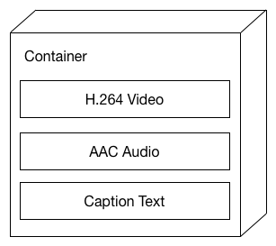

This doc is just a stub right now. Check back later for updates.

# General
When we talk about video, we normally think about it as one monolithic thing. If you ponder it for a moment though, you'll realize it's actually two distinct sorts of information that are presented to the viewer in tandem: a series of pictures and a sequence of audio samples. The temporal nature of audio and video is shared but the techniques used to efficiently transmit them are very different and necessitate a lot of the complexity in video file formats. Bundling up these (at least) two streams into a single package is the first of many issues introduced by the need to serialize video data and is solved by meta-formats called _containers_.

Containers formats are probably the most recongnizable of the video components because they get the honor of determining the file extension. You've probably heard of MP4, MOV, and WMV, all of which are container formats. Containers specify how to serialize audio, video, and metadata streams into a sequential series of bits and how to unpack them for decoding. Containers are basically a box that can hold video information and timed media data:

- codecs
- containers, multiplexing

# MPEG2-TS

- streaming vs storage
- program table
- program map table
- history, context

# H.264
- NAL units
- Annex B vs MP4 elementary stream
- access unit -> sample

# MP4
- origins: quicktime
